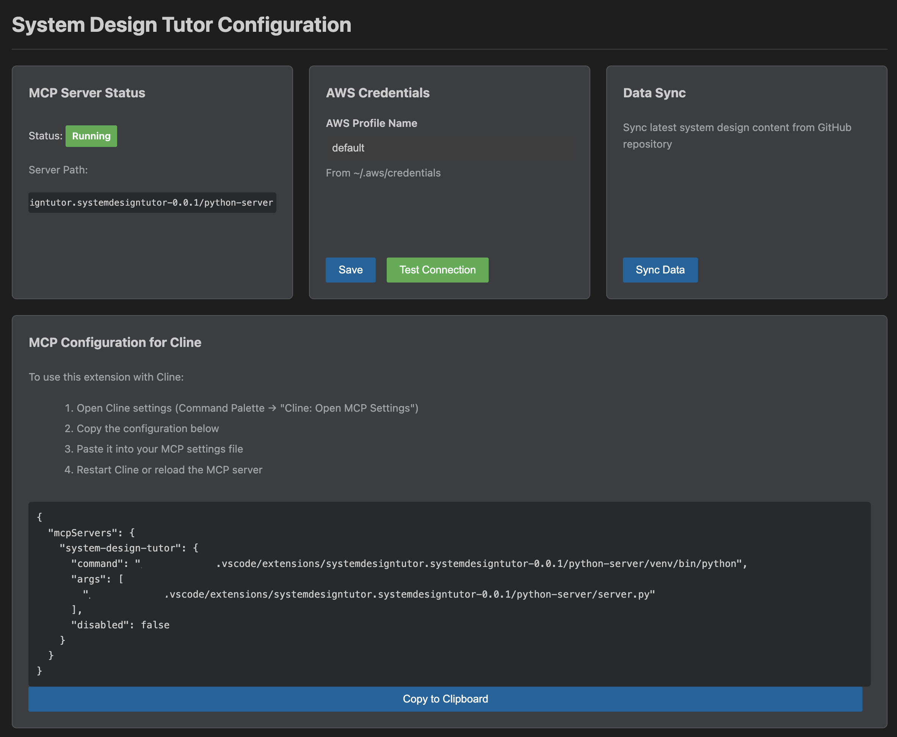

# System Design Tutor

AI-powered system design interview preparation directly in VS Code. This extension embeds an MCP server that connects to a Strands Agent powered by AWS Bedrock, providing structured guidance on system design topics.

## Features

- Interactive system design tutoring through Cline/Kiro
- Structured responses with high-level design, low-level design, and core modules
- Step-by-step learning paths with teaching points and exercises
- Vector database powered by system-design-primer repository
- Local MCP server for fast, private responses
- Sync command to update knowledge base from GitHub

## Requirements

- Node.js 20 or higher
- npm
- TypeScript compiler (tsc)
- Python 3.8 or higher
- AWS credentials configured for Bedrock access
- VS Code 1.105.0 or higher

## Getting Started

1. `npm install`
2. `npm run compile`
3. `vsce package`
4. Install the generated VSIX file in VS Code
5. Setup MCP in Cline/Kiro
6. Ask system design questions

## AWS Credentials Setup

The extension requires AWS credentials to access Bedrock LLM services. Configure credentials using one of these methods:

1. AWS CLI: `aws configure`
2. Environment variables: `AWS_ACCESS_KEY_ID`, `AWS_SECRET_ACCESS_KEY`
3. AWS credentials file: `~/.aws/credentials`

Ensure your AWS account has access to Bedrock models in your configured region.

### Configuration UI

Use the Command Palette: "System Design Tutor: Open Configuration" to access the settings panel:

## Usage

1. Open Cline/Kiro in VS Code
2. Ask system design questions like: "Teach me the design Real-time Chat System"
3. Receive structured guidance with architecture, modules, and learning steps
4. Use Command Palette: "System Design Tutor: Sync System Design Data" to update knowledge base

## Extension Settings

- `systemdesigntutor.bedrockRegion`: AWS Bedrock region (default: us-east-1)
- `systemdesigntutor.bedrockModel`: Bedrock model ID (default: anthropic.claude-3-sonnet-20240229-v1:0)
- `systemdesigntutor.mcpServerPort`: MCP server port (default: 0 for auto-assign)

## Troubleshooting

### Python Not Found
Ensure Python 3.8+ is installed and available in your PATH.

### MCP Server Failed to Start
Check the Output panel (View > Output > System Design Tutor) for error messages.

### Bedrock Access Denied
Verify AWS credentials are configured and your account has Bedrock access.

### Empty Responses
Run the sync command to populate the vector database with system design content.

## License

MIT

## Contributing

Contributions welcome! Please open issues and pull requests on GitHub.

## Acknowledgments

Knowledge base powered by [system-design-primer](https://github.com/donnemartin/system-design-primer) repository.
